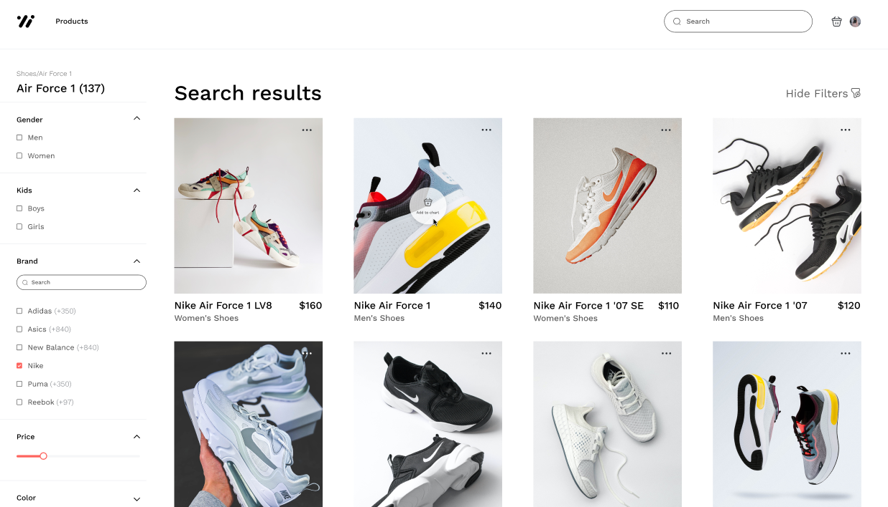

# 👟 Shoes Shop – Team 3

Welcome to the **Team 3 Shoes Shop** repository! This project serves as a professional showcase of our team skills and expertise in web development. It is built using modern web technologies to ensure high performance, scalability, and maintainability.

## 🌍 Live Demo

Check out the live version of the website:
🔗 **[shoes-shop-team-3.vercel.app](https://shoes-shop-team-3.vercel.app)**

<p align="center">
  <a href="https://shoes-shop-team-3.vercel.app" target="_blank"></a>
</p>

---

## 🛠️ Technologies Used

### 🧩 **Frontend Stack**

- **⚡ TypeScript** – Ensures type safety and scalability.
- **⚛ React.js** – Component-based library for building dynamic UIs.
- **🚀 Next.js** – Powerful React framework for SSR, routing, and SEO optimization.
- **🎨 MUI (Material UI)** – Customizable component library for fast, accessible, and responsive UI.
- **🔐 NextAuth** – Authentication and session management solution.
- **🔄 React Query** – Data fetching and caching for better API interactions.

### ✅ **Testing & Quality**

- **🧪 Jest** – Unit and integration testing for React components and logic.
- **🧹 ESLint & Prettier** – Ensures code consistency and quality.
- **🔁 CI Tools** – Automated testing and linting integrated in development workflows.

### 🚀 **Deployment**

- **🌐 Vercel** – Cloud platform for frontend hosting with seamless CI/CD.

---

## 🏗️ Getting Started

To run the project locally, follow these steps:

### 1️⃣ Clone the Repository

```bash
git clone https://github.com/Solvd-React-Laba-Team-3/shoes-shop.git
```

### 2️⃣ Navigate to the Project Directory

```bash
cd shoes-shop
```

### 3️⃣ Install Dependencies

```bash
npm install
```

### 4️⃣ Configure Environment Variables

Create a `.env` file in the root directory and add the necessary variables as shown in `.env.example`.

### 5️⃣ Start the Development Server

```bash
npm run dev
```

The local development server will be available at:
🔗 **[http://localhost:3000](http://localhost:3000)**

---

## 🔗 Useful Links

- **📋 Code Style Conventions:**
  [CODE_STYLE.md](.CODE_STYLE.md)

- **📜 API Documentation (Swagger):**
  [Swagger Link](https://shoes-shop-strapi.herokuapp.com/documentation#)

- **🎨 Figma Design:**
  [Figma Design Link](https://www.figma.com/design/ny4CJBOFrocjV27M3ev76q/%F0%9F%93%93-Shoes-shop---for-dev-s-learning)

- **📌 Team Miro Board:**
  [Miro Board Link](https://miro.com/welcomeonboard/NCtLZkRYdTlBSlIxYllwd1l6VGFRUkZIV3BWZVVodWZLUHBGa01zRm1uTjZmRTN6UHN5elNWMkFQb3JqbjN4aEFBTGFWRzNjYm9ua3VWYWlPSEtqYjZjYjR0cjhSQUZZRko5d250S2hVZ3VEMWtheW55MkxqN2s1enB6ZFliLzNyVmtkMG5hNDA3dVlncnBvRVB2ZXBnPT0hdjE=?share_link_id=106311290403)

---

## 🤝 Our Developers Team

- **[Dmytro Oborskyi](https://github.com/EcchiGrill)**
- **[Jefferson Lima](https://github.com/jefftb540)**
- **[Evgenij Ilyin](https://github.com/Evgenij-Ilyin)**
- **[Olha Kucheruk](https://github.com/Olha36)**
- **[Diego Jabie](https://github.com/DiegoJabie142)**
